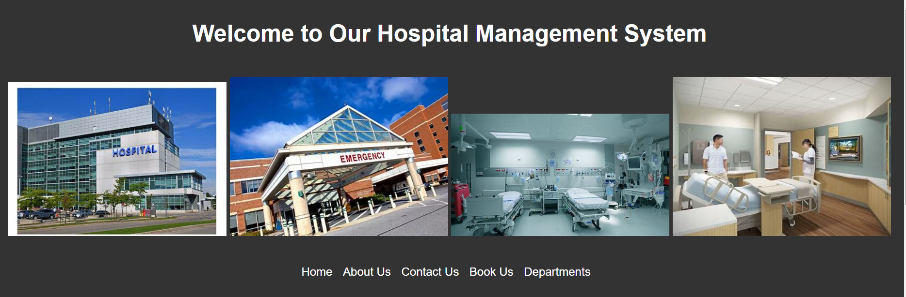

# Hospital Management System

## Project Name
Hospital Management System

## Introduction
The Hospital Management System is a comprehensive web application designed to streamline hospital operations, from patient management to appointment scheduling. It aims to improve efficiency and patient care by providing a centralized platform for hospital staff and patients.

- **Deployed Site**: (https://hospital-management-system-ruddy.vercel.app/)]
- **Final Project Blog Article**: [Link to your final project blog article]
- **Author(s) LinkedIn**: (https://www.linkedin.com/in/Oluwakuti)]

## Screenshots

